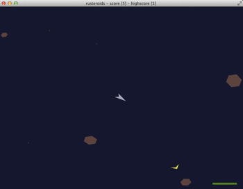

# Rusteroids
#### an asteroids clone built in Rust

### Build Status
branch | status
----|----
develop | [](https://travis-ci.org/benbrunton/rusteroids)
**master** | [](https://travis-ci.org/benbrunton/rusteroids)


## Building
### Requirements:
- [gflw](http://www.glfw.org/)
- [rust](http://www.rust-lang.org/)
- [cargo](http://doc.crates.io/)

## Playing
```bash
    cargo run
```

### Gameplay
[](http://www.youtube.com/watch?v=Jb8oIn0ot6w)

Follow the yellow arrow and collect the token to score a point

###Controls
| Key |Movement |
| ------: | :------|
| up | forwards thrust  |
|down |backwards thrust | 
|left						  | left |
|right					  | right |
| spacebar |fire						  |
| shift |shield					  |
