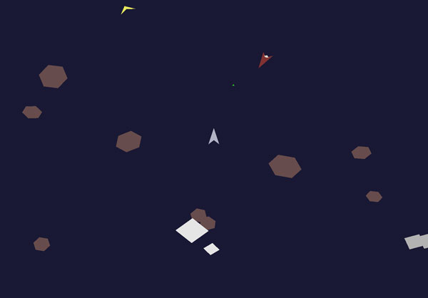

# Rusteroids
#### an asteroids clone built in Rust

#### develop branch
))]]

## Building
### Requirements:
- gflw
- rust
- cargo

## Playing
    cargo run

### Screenshot

### Gameplay

follow the yellow arrow and collect the token to score

arrow keys to move

spacebar to fire

shift for shield
